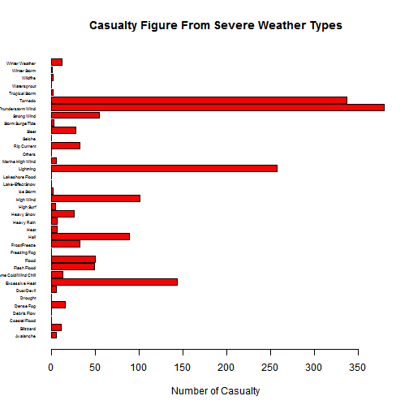

## What is Storm Explorer

1. Based on NOAA database of severe weather events between 1950 and 2011
2. Intend to show which events cause most human casualty and economic damage in different states
3. Created with R's Shiny package

--- .class #id 

## How to use

1. go to [storm explorer app](https://ianf2015.shinyapps.io/shiny-app/) 
2. select from pull-down menu the abbreviation of the state you want to explore
3. two bar charts will be shown with the top one showing the casualty figure from weather events and the bottom one showing econmic damage in thousands of US dollars

--- .class #id

## List of event types


```
##  [1] "High Surf"                "Flash Flood"             
##  [3] "Thunderstorm Wind"        "Others"                  
##  [5] "Frost/Freeze"             "Astronomical Low Tide"   
##  [7] "Avalanche"                "Blizzard"                
##  [9] "Dust Storm"               "Wildfire"                
## [11] "Coastal Flood"            "Storm Surge/Tide"        
## [13] "Cold/Wind Chill"          "Tornado"                 
## [15] "Dense Fog"                "Dense Smoke"             
## [17] "Strong Wind"              "Drought"                 
## [19] "Dust Devil"               "Watersprout"             
## [21] "Excessive Heat"           "Heavy Rain"              
## [23] "Heavy Snow"               "Extreme Cold/Wind Chill" 
## [25] "Flood"                    "Freezing Fog"            
## [27] "Sleet"                    "Funnel Cloud"            
## [29] "Ice Storm"                "Hail"                    
## [31] "Heat"                     "Lake-Effect Snow"        
## [33] "Lightning"                "Marine High Wind"        
## [35] "Rip Current"              "High Wind"               
## [37] "Hurricane{typhoon)"       "Lakeshore Flood"         
## [39] "Winter Weather"           "Marine Hail"             
## [41] "Marine Strong Wind"       "Marine Thunderstorm Wind"
## [43] "Debris Flow"              "Seiche"                  
## [45] "Tropical Depression"      "Tropical Storm"          
## [47] "Tsunami"                  "Volcanic Ash"            
## [49] "Winter Storm"
```

--- .class #id

## Example: State of New York


